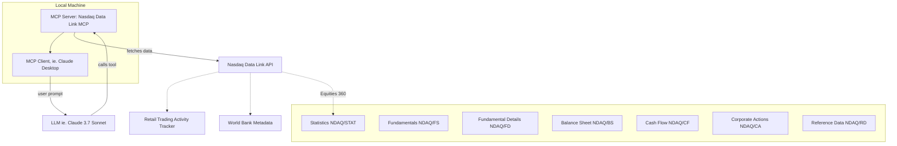

<div align="center">

# 📈 Nasdaq Data Link MCP 🤖 

</div>

<div align="center">

[](LICENSE)
[](https://pypi.org/project/nasdaq-data-link-mcp-os/)


</div>

A community developed and maintained [Model Context Protocol (MCP)](https://github.com/modelcontextprotocol) server that provides access to [Nasdaq Data Link](https://data.nasdaq.com/). Built for use with MCP-compatible [clients](https://modelcontextprotocol.io/clients).

This project aims at making easy to access and explore Nasdaq Data Link’s extensive and valuable financial and economic datasets through natural language interfaces and large language models (LLMs).

🐍 This project uses the official [nasdaq/data-link-python SDK](https://github.com/Nasdaq/data-link-python)

> **Disclaimer:** This is an open-source project *not affiliated with or endorsed by Nasdaq, Inc.* Nasdaq® is a registered trademark of Nasdaq, Inc.


## 🌐 Usage

| [](https://www.loom.com/share/b0299f6f6f1844669b5d2f73a86a3dcb) | [](https://www.loom.com/share/a07e518bb6eb4de4b5a06a5a1a112a24) |
|:--:|:--:|
| [Nasdaq Data Link MCP - Retail Trading Activity](https://www.loom.com/share/b0299f6f6f1844669b5d2f73a86a3dcb) | [Nasdaq Data Link MCP - World Bank Data](https://www.loom.com/share/a07e518bb6eb4de4b5a06a5a1a112a24) |

Once installed and connected to an `MCP`-compatible client (e.g., [Claude Desktop](https://claude.ai/download), this server exposes several tools that your AI assistant can use to fetch data.

In this version (`0.1.0`) the project supports the following databases:
- [World Bank dataset on Nasdaq Data Link](https://data.nasdaq.com/databases/WB) (freely available for personal use)
- [Nasdaq RTAT](https://data.nasdaq.com/databases/RTAT) (preview available for free, full data under subscription)
- [Equities 360](https://data.nasdaq.com/databases/E360) (company statistics and fundamental data)

<details>
<summary><strong>Example conversations</strong></summary>

> **You:** What were the most traded stocks by retailers yesterday?  
> **Claude:** *calls `get_rtat(<yetserday>)` and returns relevant matches*

> **You:** What was the GDP of Italy in 2022?  
> **Claude:** Let me look that up... *calls `get_indicator_value` tool*  
> **Claude:** The GDP of Italy in 2022 was approximately `...` trillion USD.

> **You:** List all indicators related to CO₂ emissions.  
> **Claude:** *calls `search_worldbank_indicators("CO2")` and returns relevant matches*

> **You:** What's the market cap and P/E ratio of Microsoft?  
> **Claude:** *calls `get_stock_stats(symbol="MSFT")` and presents the key statistics*

> **You:** Show me Microsoft's profitability ratios for the most recent annual report.  
> **Claude:** *calls `get_fundamental_data(symbol="MSFT", dimension="MRY")` and presents profitability metrics*

> **You:** What's Microsoft's cash flow and R&D spending for the last quarter?  
> **Claude:** *calls `get_detailed_financials(symbol="MSFT", dimension="MRQ")` and presents cash flow and R&D data*

> **You:** What's Microsoft's asset breakdown and debt-to-equity ratio from the latest balance sheet?  
> **Claude:** *calls `get_balance_sheet_data(symbol="MSFT", dimension="MRQ")` and presents relevant balance sheet items*

> **You:** How has Microsoft's free cash flow and capital expenditure changed over the past year?  
> **Claude:** *calls `get_cash_flow_data(symbol="MSFT", dimension="MRY")` and analyzes free cash flow trends*

> **You:** Has Tesla had any stock splits in the last two years?  
> **Claude:** *calls `get_corporate_action_data(symbol="TSLA", action="split")` and presents the split history*

> **You:** What industry and sector is AMD in, and where is the company located?  
> **Claude:** *calls `get_company_reference_data(symbol="AMD")` and presents industry, sector, and location information*
</details>

---

## 📦 Installation

### 1. Clone the Repository

```bash
git clone https://github.com/stefanoamorelli/nasdaq-data-link-mcp.git
cd nasdaq-data-link-mcp
```

### 2. Install Requirements

You'll need Python 3.10+ and the `mcp` CLI.

```bash
pip install mcp nasdaq-data-link pycountry
```

> MCP SDK: https://github.com/modelcontextprotocol/python-sdk  
> Nasdaq Data Link SDK: https://github.com/Nasdaq/data-link-python

### 3. Get Your API Key

Sign up on [https://data.nasdaq.com/](https://data.nasdaq.com/) and copy your API key.

<details>
<summary><strong>4. Download World Bank metadata CSV</strong> (optional: only if you plan to use the World Bank database)</summary>

Download the `World Bank metadata` from [Nasdaq Data Link](https://data.nasdaq.com/databases/WB):


And save it as `metadata.csv` in the following directory:

```
nasdaq-data-link-mcp/nasdaq_data_link_mcp_os/resources/world_data_bank/metadata/metadata.csv
```
</details>


### 5. Configure the Environment

```bash
cp .env.example .env
```

Then edit `.env` and add your API key:

```
NASDAQ_DATA_LINK_API_KEY=your_api_key_here
```

### 6. Install the MCP Server

```bash
mcp install nasdaq_data_link_mcp_os/server.py --env-file .env --name "Nasdaq Data Link MCP Server"
```

This registers the server with your MCP client (e.g., Claude Desktop).

---

## 🛠️ Tools

After installation, the following tools are exposed to MCP clients:

---

<details>
<summary><strong>📈 Retail Trading Activity Tracker</strong></summary>

### `get_rtat10`

Retrieves Retail Trading Activity Tracker 10 (RTAT10) data for specific dates and optional tickers.

```json
{
  "action": "tool",
  "name": "get_rtat10",
  "params": {
    "dates": "2025-03-31,2025-03-28,2025-03-27",
    "tickers": "TSLA,TQQQ,SQQQ"
  }
}
```

Returns RTAT10 data from Nasdaq Data Link for the given dates and tickers.

---

### `get_rtat`

Retrieves Retail Trading Activity (RTAT) data for specific dates and optional tickers.

```json
{
  "action": "tool",
  "name": "get_rtat",
  "params": {
    "dates": "2025-03-31,2025-03-28,2025-03-27",
    "tickers": "TSLA,TQQQ,SQQQ"
  }
}
```

Returns RTAT data from Nasdaq Data Link for the given dates and tickers.

</details>

---

<details>
<summary><strong>📊 World Bank Tools</strong></summary>

### `get_indicator_value`

Fetch the value for a specific indicator and country.

```json
{
  "action": "tool",
  "name": "get_indicator_value",
  "params": {
    "country": "Italy",
    "indicator": "NY.GDP.MKTP.CD"
  }
}
```

Returns the latest value for that indicator.

---

### `country_code`

Returns the ISO 3-letter country code (e.g., `"ITA"` for Italy).

```json
{
  "action": "tool",
  "name": "country_code",
  "params": {
    "countryName": "Italy"
  }
}
```

---

### `list_worldbank_indicators`

Returns a list of all 1500+ indicators available.

```json
{
  "action": "tool",
  "name": "list_worldbank_indicators"
}
```

---

### `search_worldbank_indicators`

Searches for indicators by keyword.

```json
{
  "action": "tool",
  "name": "search_worldbank_indicators",
  "params": {
    "keyword": "population"
  }
}
```

</details>

---

<details>
<summary><strong>📈 Equities 360 Tools</strong></summary>

### `get_stock_stats`

Retrieves comprehensive statistics for a company from the Nasdaq Equities 360 database.

```json
{
  "action": "tool",
  "name": "get_stock_stats",
  "params": {
    "symbol": "MSFT"
  }
}
```

Or using FIGI:

```json
{
  "action": "tool",
  "name": "get_stock_stats",
  "params": {
    "figi": "BBG000BPH459"
  }
}
```

Returns company statistics including market cap, PE ratio, 52-week highs/lows, dividend information, and more.

---

### `list_stock_stat_fields`

Lists all available fields in the stock statistics database with descriptions.

```json
{
  "action": "tool",
  "name": "list_stock_stat_fields"
}
```

Returns information about all available fields that can be queried through the `get_stock_stats` tool.

---

### `get_fundamental_data`

Retrieves fundamental financial data from the Nasdaq Equities 360 Fundamental Summary database.

```json
{
  "action": "tool",
  "name": "get_fundamental_data",
  "params": {
    "symbol": "MSFT",
    "dimension": "MRY"
  }
}
```

Or using multiple parameters:

```json
{
  "action": "tool",
  "name": "get_fundamental_data",
  "params": {
    "figi": "BBG000BPH459",
    "calendardate": "2022-12-31",
    "dimension": "MRQ"
  }
}
```

Returns fundamental data including profitability ratios (ROA, ROE, ROS), valuation metrics (P/E, P/S), income statement items (revenue, gross profit), and financial health indicators (current ratio, debt-to-equity).

---

### `list_fundamental_fields`

Lists all available fields in the fundamental summary database with descriptions.

```json
{
  "action": "tool",
  "name": "list_fundamental_fields"
}
```

Returns information about all available fields that can be queried through the `get_fundamental_data` tool.

---

### `get_detailed_financials`

Retrieves detailed financial data from the Nasdaq Equities 360 Fundamental Details database.

```json
{
  "action": "tool",
  "name": "get_detailed_financials",
  "params": {
    "symbol": "MSFT",
    "dimension": "MRQ"
  }
}
```

Or using multiple parameters:

```json
{
  "action": "tool",
  "name": "get_detailed_financials",
  "params": {
    "figi": "BBG000BPH459",
    "calendardate": "2022-12-31",
    "dimension": "MRY"
  }
}
```

Returns comprehensive financial statement data including balance sheet items (assets, liabilities, equity), income statement components (revenue, expenses, profit), cash flow details (operating, investing, financing), and detailed financial ratios.

---

### `list_detailed_financial_fields`

Lists all available fields in the fundamental details database with descriptions.

```json
{
  "action": "tool",
  "name": "list_detailed_financial_fields"
}
```

Returns information about all available fields that can be queried through the `get_detailed_financials` tool.

---

### `get_balance_sheet_data`

Retrieves balance sheet data from the Nasdaq Equities 360 Balance Sheet database.

```json
{
  "action": "tool",
  "name": "get_balance_sheet_data",
  "params": {
    "symbol": "MSFT",
    "dimension": "MRQ"
  }
}
```

Or using multiple parameters:

```json
{
  "action": "tool",
  "name": "get_balance_sheet_data",
  "params": {
    "figi": "BBG000BPH459",
    "calendardate": "2022-12-31",
    "dimension": "MRY"
  }
}
```

Returns comprehensive balance sheet data including assets (current, non-current, intangible), liabilities (current, non-current, debt), stockholders' equity, and key balance sheet metrics.

---

### `list_balance_sheet_fields`

Lists all available fields in the balance sheet database with descriptions.

```json
{
  "action": "tool",
  "name": "list_balance_sheet_fields"
}
```

Returns information about all available fields that can be queried through the `get_balance_sheet_data` tool.

---

### `get_cash_flow_data`

Retrieves cash flow statement data from the Nasdaq Equities 360 Cash Flow database.

```json
{
  "action": "tool",
  "name": "get_cash_flow_data",
  "params": {
    "symbol": "MSFT",
    "dimension": "MRQ"
  }
}
```

Or using multiple parameters:

```json
{
  "action": "tool",
  "name": "get_cash_flow_data",
  "params": {
    "figi": "BBG000BPH459",
    "calendardate": "2022-12-31",
    "dimension": "MRY"
  }
}
```

Returns cash flow statement data including operating activities (ncfo), investing activities (ncfi), financing activities (ncff), free cash flow (fcf), capital expenditures (capex), and more.

---

### `list_cash_flow_fields`

Lists all available fields in the cash flow statement database with descriptions.

```json
{
  "action": "tool",
  "name": "list_cash_flow_fields"
}
```

Returns information about all available fields that can be queried through the `get_cash_flow_data` tool.

---

### `get_corporate_action_data`

Retrieves corporate actions data from the Nasdaq Equities 360 Corporate Actions database.

```json
{
  "action": "tool",
  "name": "get_corporate_action_data",
  "params": {
    "symbol": "TSLA",
    "action": "split"
  }
}
```

Or using other parameters:

```json
{
  "action": "tool",
  "name": "get_corporate_action_data",
  "params": {
    "date": "2023-03-24"
  }
}
```

Returns information about corporate events such as stock splits, mergers, acquisitions, and other significant company actions that can affect stock price and ownership.

---

### `list_corporate_action_fields`

Lists all available fields in the corporate actions database with descriptions.

```json
{
  "action": "tool",
  "name": "list_corporate_action_fields"
}
```

Returns information about all available fields that can be queried through the `get_corporate_action_data` tool.

---

### `get_company_reference_data`

Retrieves company reference data from the Nasdaq Equities 360 Reference Data database.

```json
{
  "action": "tool",
  "name": "get_company_reference_data",
  "params": {
    "symbol": "AMD"
  }
}
```

Or using FIGI:

```json
{
  "action": "tool",
  "name": "get_company_reference_data",
  "params": {
    "figi": "BBG000BBQCY0"
  }
}
```

Returns static information about companies including exchange, industry, sector classification, website URLs, SEC filing links, and location information.

---

### `list_reference_data_fields`

Lists all available fields in the company reference database with descriptions.

```json
{
  "action": "tool",
  "name": "list_reference_data_fields"
}
```

Returns information about all available fields that can be queried through the `get_company_reference_data` tool.

</details>

---

## 🧪 MCP Dev & Debugging

To test the server locally with a UI:

```bash
mcp dev nasdaq_data_link_mcp_os/server.py --env-file .env
```

This opens the `MCP` Dev interface where you can call tools manually, inspect results, and troubleshoot.

---

## 📊 Architecture Diagram


---

## 📚 References

- [Model Context Protocol Python SDK](https://github.com/modelcontextprotocol/python-sdk)
- [Nasdaq Data Link Python SDK](https://github.com/Nasdaq/data-link-python)

---

## 📄 License

[MIT License](LICENSE) © 2025 [Stefano Amorelli](https://github.com/stefanoamorelli)
