```mermaid
graph TD
  subgraph "Local Machine"
    A[MCP Server: Nasdaq Data Link MCP] --> C[MCP Client, ie. Claude Desktop]
  end

  C -->|user prompt| D[LLM ie. Claude 3.7 Sonnet]
  D -->|calls tool| A
  A -->|fetches data| B[Nasdaq Data Link API]
  B -.-> E[Retail Trading Activity Tracker]
  B -.-> F[World Bank Metadata]
  B -.-> N[Trade Summary NDAQ/TS]

  subgraph "Nasdaq Fund Network (NFN)"
    O1[Fund Master MFRFM]
    O2[Fund Information MFRFI]
    O3[Share Class Master MFRSM]
    O4[Share Class Info MFRSI]
    O5[Price History MFRPH/MFRPH10]
    O6[Performance MFRPS/MFRPRB/MFRPA]
    O7[Fees & Expenses MFRPM]
    O8[Monthly Flows MFRMF]
  end

  B -.-> O1
  B -.-> O2
  B -.-> O3
  B -.-> O4
  B -.-> O5
  B -.-> O6
  B -.-> O7
  B -.-> O8

  subgraph " "
    G[Statistics NDAQ/STAT]
    H[Fundamentals NDAQ/FS]
    I[Fundamental Details NDAQ/FD]
    J[Balance Sheet NDAQ/BS]
    K[Cash Flow NDAQ/CF]
    L[Corporate Actions NDAQ/CA]
    M[Reference Data NDAQ/RD]
  end

B -.->|Equities 360| G
```

<div align="center">

# 📈 Nasdaq Data Link MCP 🤖

</div>

<div align="center">

[](LICENSE)
[](https://pypi.org/project/nasdaq-data-link-mcp-os/)


[](https://pepy.tech/projects/nasdaq-data-link-mcp-os)

</div>

A community developed and maintained [Model Context Protocol (MCP)](https://github.com/modelcontextprotocol) server that provides access for large language models to the [Nasdaq Data Link](https://data.nasdaq.com/). Built for use with MCP-compatible [clients](https://modelcontextprotocol.io/clients).

This project aims at making easy to access and explore Nasdaq Data Link's extensive and valuable financial and economic datasets through natural language interfaces and large language models (LLMs).

🐍 `Nasdaq Data Link MCP` uses the official [Nasdaq/data-link-python](https://github.com/Nasdaq/data-link-python) SDK.

> [!IMPORTANT]
> This is an open-source project *not affiliated with or endorsed by Nasdaq, Inc.* Nasdaq® is a registered trademark of Nasdaq, Inc.

## 🌐 Usage

| [](https://www.loom.com/share/b0299f6f6f1844669b5d2f73a86a3dcb) | [](https://www.loom.com/share/a07e518bb6eb4de4b5a06a5a1a112a24) |
|:--:|:--:|
| [Nasdaq Data Link MCP - Retail Trading Activity](https://www.loom.com/share/b0299f6f6f1844669b5d2f73a86a3dcb) | [Nasdaq Data Link MCP - World Bank Data](https://www.loom.com/share/a07e518bb6eb4de4b5a06a5a1a112a24) |
| [](https://www.loom.com/share/46c7df4cb4c4405aa9e0a49ce6cd75be) | |
| [Nasdaq Data Link MCP - Groq + DeepSeek R1 RTAT 10](https://www.loom.com/share/46c7df4cb4c4405aa9e0a49ce6cd75be) | |

Once installed and connected to an `MCP`-compatible client (e.g., [Claude Desktop](https://claude.ai/download), or [Groq Desktop (beta)](https://github.com/groq/groq-desktop-beta), this server provides 5 essential tools that work with **any** Nasdaq Data Link database.

**Featured databases:**
- [World Bank](https://data.nasdaq.com/databases/WB) - Global development indicators
- [Equities 360](https://data.nasdaq.com/databases/E360) - Company fundamentals and financials
- [Nasdaq RTAT](https://data.nasdaq.com/databases/RTAT) - Retail trading activity
- [Nasdaq Fund Network (NFN)](https://data.nasdaq.com/databases/MFR) - Mutual funds and ETFs
- ...and 100+ more databases via dataset codes

<details>
<summary><strong>Example conversations</strong></summary>

> **You:** What was the GDP of Italy in 2022?
> **Claude:** *searches datasets, gets WORLDBANK/GDP data*

> **You:** Show me Apple stock data for Q1 2024
> **Claude:** *gets WIKI/AAPL dataset with date filters*

> **You:** What datasets are available for CO₂ emissions?
> **Claude:** *searches datasets for "CO2 emissions"*

> **You:** Export Tesla data as JSON
> **Claude:** *exports dataset in JSON format*
</details>

---

## 📦 Installation

### 1. Clone the Repository

```bash
git clone https://github.com/stefanoamorelli/nasdaq-data-link-mcp.git
cd nasdaq-data-link-mcp
```

### 2. Install Requirements

You'll need Python 3.13+ and the `mcp` CLI.

```bash
uv init mcp
uv add "mcp[cli]"
```

> MCP SDK: https://github.com/modelcontextprotocol/python-sdk
> Nasdaq Data Link SDK: https://github.com/Nasdaq/data-link-python

### 3. Get Your API Key

Sign up on [https://data.nasdaq.com/](https://data.nasdaq.com/) and copy your API key.

### 4. Configure the Environment

```bash
cp .env.example .env
```

Then edit `.env` and add your API key:

```
NASDAQ_DATA_LINK_API_KEY=your_api_key_here
```

And the `PYTHONPATH`:
```
PYTHONPATH=/path/to/your/local/cloned/repo/nasdaq-data-link-mcp
```

### 5. Install the MCP Server

```bash
uv run mcp install nasdaq_data_link_mcp_os/server.py --env-file .env --name "Nasdaq Data Link MCP Server" --with nasdaq-data-link --with pycountry
```

This registers the server with your MCP client (e.g., Claude Desktop).

---

## 🧪 Testing

Run the test suite:

```bash
python -m pytest tests/ -v
```

The test suite includes:
- Basic functionality tests
- Module import verification
- Parameter validation
- Error handling
- Integration tests

Tests are designed to work without requiring an API key for basic functionality verification.

---

## 🛠️ Tools

The server exposes 5 essential tools that work with any Nasdaq Data Link database:

### `search_datasets`
Search for datasets by keyword.

**Examples:**
```python
# Find GDP datasets
search_datasets(query="GDP")

# Search for oil prices
search_datasets(query="oil prices")

# Find retail trading data
search_datasets(query="retail trading")

# Search for fund data
search_datasets(query="mutual funds")
```

### `get_dataset`
Get data from a specific dataset with optional date filters.

**Examples:**
```python
# Get Apple stock data for Q1 2024
get_dataset(dataset_code="WIKI/AAPL", start_date="2024-01-01", end_date="2024-03-31")

# Get World Bank GDP data
get_dataset(dataset_code="WORLDBANK/GDP_MKTP_CD")

# Get retail trading activity
get_dataset(dataset_code="NDAQ/RTAT", start_date="2024-03-01")

# Get company fundamentals
get_dataset(dataset_code="QOR/STATS_MSFT")

# Get fund price history
get_dataset(dataset_code="NFN/MFRPH_ABCDX", start_date="2024-01-01", end_date="2024-12-31")
```

### `get_dataset_metadata`
Get metadata about a dataset without downloading data.

**Examples:**
```python
# Check GDP dataset structure
get_dataset_metadata(dataset_code="WORLDBANK/GDP_MKTP_CD")

# View available columns for Apple stock
get_dataset_metadata(dataset_code="WIKI/AAPL")

# Inspect fund data structure
get_dataset_metadata(dataset_code="NFN/MFRFM")
```

### `list_databases`
List available databases on Nasdaq Data Link.

**Example:**
```python
list_databases()
```

### `export_dataset`
Export dataset in different formats (CSV, JSON, XML).

**Examples:**
```python
# Export Apple data as JSON
export_dataset(dataset_code="WIKI/AAPL", output_format="json", start_date="2024-01-01")

# Export to CSV with date range
export_dataset(dataset_code="WORLDBANK/GDP_MKTP_CD", output_format="csv", start_date="2020-01-01", end_date="2023-12-31")

# Export as XML
export_dataset(dataset_code="NDAQ/RTAT", output_format="xml")
```

---

## 🧪 MCP Dev & Debugging

To test the server locally with a UI:

```bash
mcp dev nasdaq_data_link_mcp_os/server.py --env-file .env
```

This opens the `MCP` Dev interface where you can call tools manually, inspect results, and troubleshoot.

---

## 📊 Architecture Diagram


---

## 📚 References

- [Model Context Protocol Python SDK](https://github.com/modelcontextprotocol/python-sdk)
- [Nasdaq Data Link Python SDK](https://github.com/Nasdaq/data-link-python)

---

## 📖 Citation

> [!TIP]
> If you use this project in your research or work, please cite it using the [CITATION.cff](CITATION.cff) file, or the APA format:

`Amorelli, S. (2025). Nasdaq Data Link MCP (Model Context Protocol) Server [Computer software]. GitHub. https://github.com/stefanoamorelli/nasdaq-data-link-mcp`

---

## 📄 License

[MIT License](LICENSE) © 2025 [Stefano Amorelli](https://github.com/stefanoamorelli)
