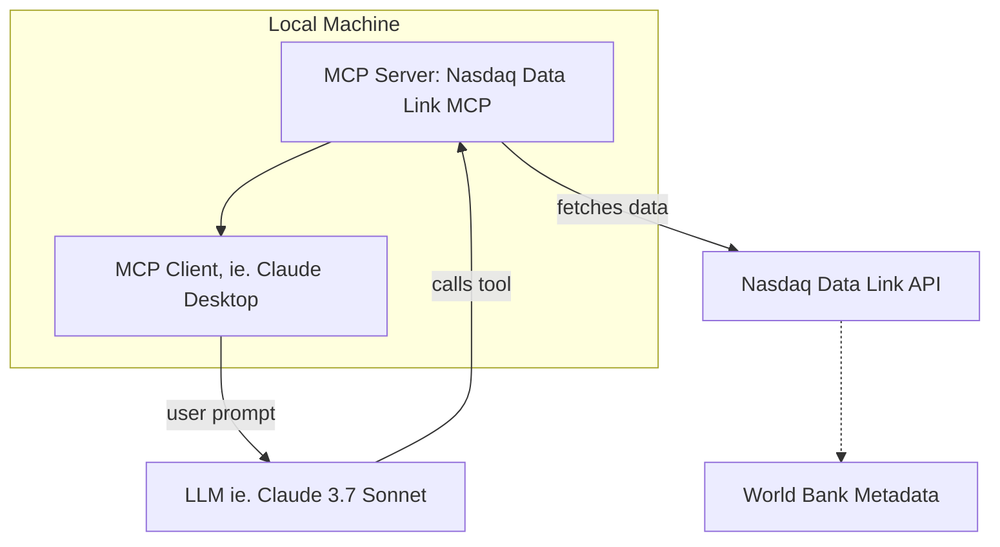

<div align="center">

# 📈 Nasdaq Data Link MCP 🤖 

</div>

<div align="center">

[](LICENSE)


</div>

A community-developed and maintained [Model Context Protocol (MCP)](https://github.com/modelcontextprotocol) server that provides access to [Nasdaq Data Link](https://data.nasdaq.com/). Built for use with MCP-compatible [clients](https://modelcontextprotocol.io/clients).

This project aims at making easy to access and explore Nasdaq Data Link’s extensive and valuable financial and economic datasets through natural language interfaces and large language models (LLMs).

> **Disclaimer:** This is an open-source project *not affiliated with or endorsed by Nasdaq, Inc.* Nasdaq® is a registered trademark of Nasdaq, Inc.


## 🌐 Usage

<div align="center">
    <a href="https://www.loom.com/share/a07e518bb6eb4de4b5a06a5a1a112a24">
      
    </a>
    <a href="https://www.loom.com/share/a07e518bb6eb4de4b5a06a5a1a112a24">
      <p>Nasdaq Data Link MCP - Usage</p>
    </a>
</div>

Once installed and connected to an `MCP`-compatible client (e.g., [Claude Desktop](https://claude.ai/download), this server exposes several tools that your AI assistant can use to fetch data.

In this first version (`0.0.1`) the project only supports **the [World Bank dataset on Nasdaq Data Link](https://data.nasdaq.com/databases/WB)** (freely available for personal use).

Example conversations might include:

> **You:** What was the GDP of Italy in 2022?  
> **Claude:** Let me look that up... *calls `get_indicator_value` tool*  
> **Claude:** The GDP of Italy in 2022 was approximately `...` trillion USD.

Or:

> **You:** List all indicators related to CO₂ emissions.  
> **Claude:** *calls `search_worldbank_indicators("CO2")` and returns relevant matches*

---

## 📦 Installation

### 1. Clone the Repository

```bash
git clone https://github.com/stefanoamorelli/nasdaq-data-link-mcp.git
cd nasdaq-data-link-mcp
```

### 2. Install Requirements

You'll need Python 3.10+ and the `mcp` CLI.

```bash
pip install mcp nasdaq-data-link pycountry
```

> MCP SDK: https://github.com/modelcontextprotocol/python-sdk  
> Nasdaq Data Link SDK: https://github.com/Nasdaq/data-link-python

### 3. Get Your API Key

Sign up on [https://data.nasdaq.com/](https://data.nasdaq.com/) and copy your API key.

### 4. Download Metadata CSV

Download the `World Bank metadata` from [Nasdaq Data Link](https://data.nasdaq.com/databases/WB):


And save it as `metadata.csv` in the following directory:

```
nasdaq-data-link-mcp/src/resources/world_data_bank/metadata/metadata.csv
```


### 5. Configure the Environment

```bash
cp .env.example .env
```

Then edit `.env` and add your API key:

```
NASDAQ_DATA_LINK_API_KEY=your_api_key_here
```

### 6. Start the MCP Server

```bash
mcp install src/server.py --env-file .env --name "NASDAQ Data Link MCP Server"
```

This registers the server with your MCP client (e.g., Claude Desktop).

---

## 🛠️ Tools

After installation, the following tools are exposed to MCP clients:

### `get_indicator_value`

Fetch the value for a specific indicator and country.

```json
{
  "action": "tool",
  "name": "get_indicator_value",
  "params": {
    "country": "Italy",
    "indicator": "NY.GDP.MKTP.CD"
  }
}
```

Returns the latest value for that indicator.

---

### `country_code`

Returns the ISO 3-letter country code (e.g., `"ITA"` for Italy).

```json
{
  "action": "tool",
  "name": "country_code",
  "params": {
    "countryName": "Italy"
  }
}
```

---

### `list_worldbank_indicators`

Returns a list of all 1500+ indicators available.

```json
{
  "action": "tool",
  "name": "list_worldbank_indicators"
}
```

---

### `search_worldbank_indicators`

Searches for indicators by keyword.

```json
{
  "action": "tool",
  "name": "search_worldbank_indicators",
  "params": {
    "keyword": "population"
  }
}
```

---

## 🧪 MCP Dev & Debugging

To test the server locally with a UI:

```bash
mcp dev src/server.py --env-file .env
```

This opens the `MCP` Dev interface where you can call tools manually, inspect results, and troubleshoot.

---

## 📊 Architecture Diagram



---

## 📚 References

- [Model Context Protocol Python SDK](https://github.com/modelcontextprotocol/python-sdk)
- [Nasdaq Data Link Python SDK](https://github.com/Nasdaq/data-link-python)

---

## 📄 License

[MIT License](LICENSE) © 2025 [Stefano Amorelli](https://github.com/stefanoamorelli)
