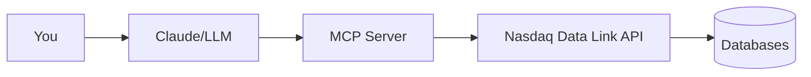
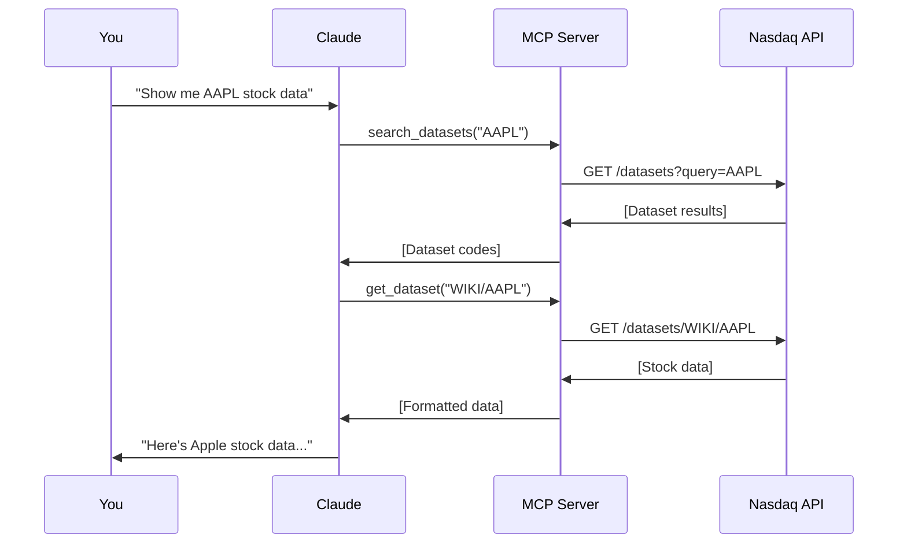

## Architecture

Nasdaq Data Link MCP acts as a bridge between AI assistants and the Nasdaq Data Link API:



## Key Components

### 1. MCP Server

The server exposes 5 tools that Claude can call:
- `search_datasets` - Find datasets by keyword
- `get_dataset` - Retrieve dataset data
- `get_dataset_metadata` - Inspect dataset structure
- `list_databases` - Browse available databases
- `export_dataset` - Export data in different formats

### 2. Databases

Databases are collections of related datasets. Examples:
- **WORLDBANK** - Global development indicators
- **QOR** (Equities 360) - Company financials
- **NFN** - Mutual fund data
- **NDAQ** - Nasdaq market data

### 3. Datasets

Datasets are specific data tables within databases. Format: `DATABASE/DATASET`

Examples:
- `WORLDBANK/USA_NY.GDP.MKTP.CD` - US GDP
- `QOR/STATS_AAPL` - Apple statistics
- `NFN/MFRFM` - Fund master report

## How It Works

### Query Flow

<Steps>
  <Step title="You Ask a Question">
    "What was Italy's GDP in 2022?"
  </Step>

  <Step title="Claude Decides What to Do">
    Claude analyzes your question and determines it needs GDP data
  </Step>

  <Step title="Claude Calls Tools">
    ```python
    # Claude might call:
    search_datasets(query="Italy GDP")
    # Then:
    get_dataset(dataset_code="WORLDBANK/ITA_NY.GDP.MKTP.CD")
    ```
  </Step>

  <Step title="Server Fetches Data">
    The MCP server queries Nasdaq Data Link API with your credentials
  </Step>

  <Step title="Claude Presents Results">
    Claude formats and explains the data in natural language
  </Step>
</Steps>

## Dataset Codes

Dataset codes follow the pattern: `DATABASE_CODE/DATASET_CODE`

<CodeGroup>

```text World Bank
WORLDBANK/USA_NY.GDP.MKTP.CD
└─ Database: WORLDBANK
   └─ Dataset: USA GDP (current US$)
```

```text Equities
QOR/STATS_MSFT
└─ Database: QOR (Equities 360)
   └─ Dataset: Microsoft statistics
```

```text Funds
NFN/MFRFM
└─ Database: NFN (Fund Network)
   └─ Dataset: Fund master report
```

</CodeGroup>

## Data Flow



## Security

<Note>
  All data requests are made from your local machine using your API key. Neither Claude nor Anthropic can access your Nasdaq Data Link account.
</Note>

- API keys are stored locally in `.env`
- All requests go through your MCP server
- No data is sent to Anthropic's servers
- You maintain full control over access

## Rate Limits

Nasdaq Data Link enforces rate limits based on your account tier:

| Tier | Calls/Day | Calls/10min |
|------|-----------|-------------|
| Free | 50,000 | 300 |
| Premium | Unlimited | 2,000+ |

The MCP server respects these limits and will return errors if exceeded.

## Next Steps

<CardGroup cols={2}>
  <Card
    title="Explore Databases"
    icon="database"
    href="/concepts/databases"
  >
    Learn about available databases
  </Card>
  <Card
    title="Understand Datasets"
    icon="table"
    href="/concepts/datasets"
  >
    Deep dive into dataset structure
  </Card>
</CardGroup>
